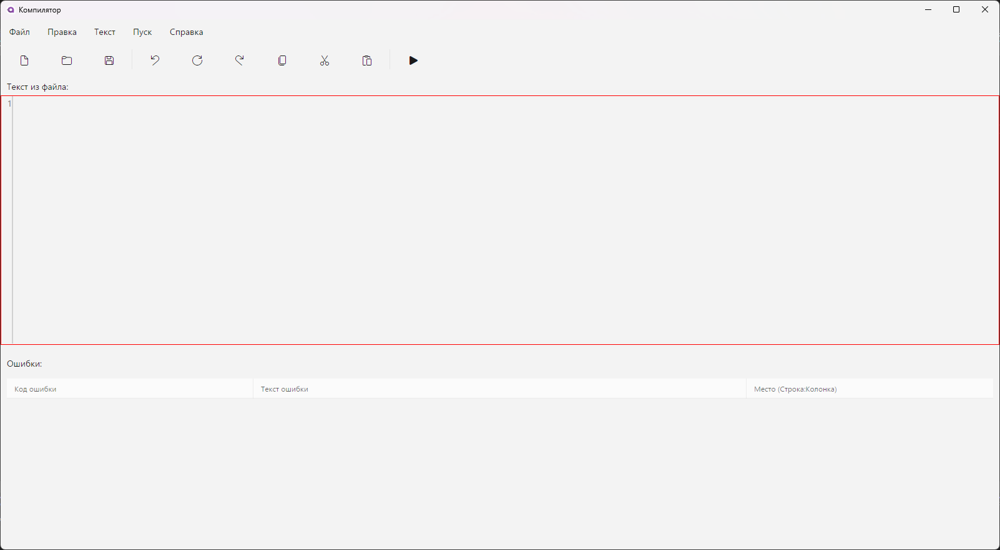
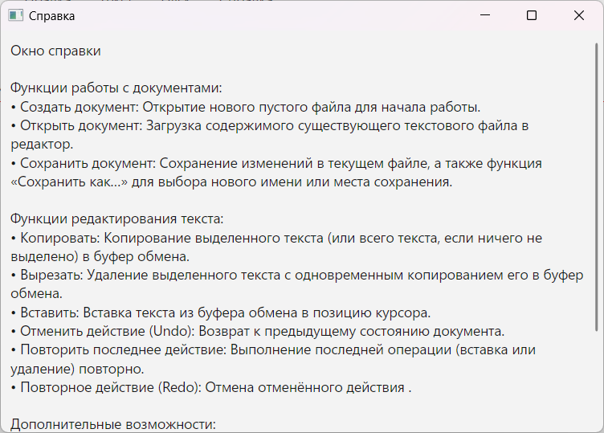
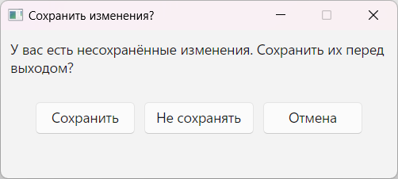
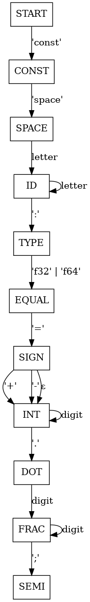
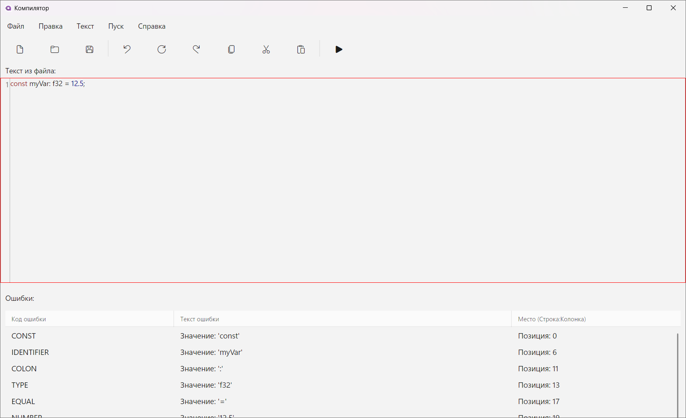
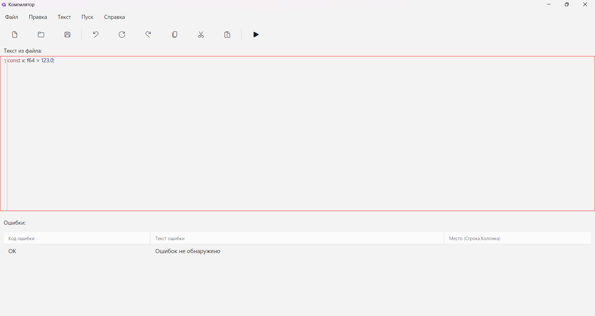
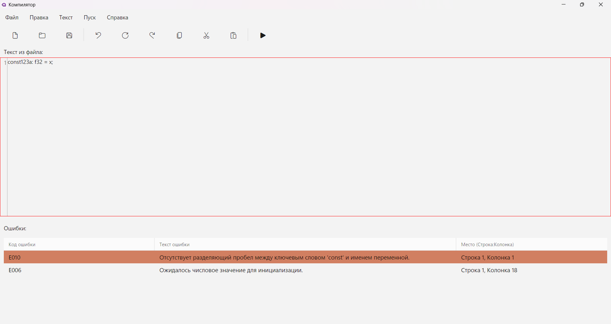

ё
# Анализатор деклараций

Разработка настольного приложения с функциями лексического и синтаксического анализатора деклараций переменных.

## Оглавление

- [Лабораторная работа №1: Создание графического интерфейса](#лабораторная-работа-1-создание-графического-интерфейса)
- [Лабораторная работа №2: Реализация лексического анализатора](#лабораторная-работа-2-реализация-лексического-анализатора)
- [Лабораторная работа №3: Реализация синтаксического анализатора](#лабораторная-работа-3-реализация-синтаксического-анализатора)
- [Лабораторная работа №4: Вывод ошибок и интерфейс взаимодействия](#лабораторная-работа-4-вывод-ошибок-и-интерфейс-взаимодействия)

---

## Лабораторная работа №1: Создание графического интерфейса

**Цель:** разработать GUI для ввода и анализа деклараций переменных.

**Технологии:** Avalonia UI, MVVM, AvaloniaEdit, FluentAvalonia

**Основной интерфейс включает:**

- текстовый редактор с подсветкой синтаксиса
- кнопку запуска анализа
- отображение ошибок в виде таблицы
- возможность открытия, создания и сохранения файлов
- базовую справочную систему
- справочная система (всплывающее окно)
- подтверждение при закрытии с несохранёнными изменениями

**Пример интерфейса:**
Интерфейс приложения

**Пример окна справки:**

**Пример окна подтверждения выхода:**


---

## Лабораторная работа №2: Реализация лексического анализатора

**Цель:** реализовать разбор строки на токены.

**Грамматика Хомского**

 Правила (P)
1.	‹Def› → const ‹Id› : ‹Type› = ‹Number› ;
2.	‹Id› → ‹Letter› ‹IdRem›
3.	‹IdRem› → ‹Letter› ‹IdRem› | ε
4.	‹Type› → f32 | f64
5.	‹Number› → ‹Sign› ‹UnsignedInt› . ‹UnsignedInt›
6.	‹Sign› → + | − | ε
7.	‹UnsignedInt› → ‹Digit› ‹UnsignedInt› | ‹Digit›
(Число обязано содержать хотя бы одну цифру до и после десятичной точки; знак «+»/«−» необязателен.)

2.2 Дополнительные обозначения
-	‹Digit› → “0” | “1” | … | “9”
-	‹Letter› → “a” | … | “z” | “A” | … | “Z”

2.3 Компоненты грамматики
-	Z (стартовый символ) = ‹Def›
-	VT (терминалы) = { const, :, f32, f64, =, ;, +, −, ., 0–9, a–z, A–Z }
-	VN (нетерминалы) = { ‹Def›, ‹Id›, ‹IdRem›, ‹Type›, ‹Number›, ‹Sign›, ‹UnsignedInt› }

**Пример диаграммы состояний:**


**Примеры обрабатываемых токенов:**

- `const`, `f32`, `f64`
- идентификаторы (например, `myVar`)
- числовые значения (например, `123.45`)
- знаки `:`, `=`, `;`

**Пример строки:**

```c
const myVar: f32 = 12.5;
```

**Выделенные токены:**



```
CONST("const"), IDENTIFIER("myVar"), COLON(:), TYPE("f32"), EQUAL(=), NUMBER(12.5), SEMICOLON(;)
```

**Обработка ошибок:** лексер может распознать недопустимые символы, отсутствие пробелов, слитые ключевые слова и т.д.

---

## Лабораторная работа №3: Реализация синтаксического анализатора

**Цель:** реализовать анализ структуры объявления и обнаружение синтаксических ошибок.

**Формат ожидаемой строки:**

```c
const <идентификатор> : <тип> = <число>;
```

**Пример корректной строки:**

```c
const a: f64 = 123.0;
```

**Пример ошибок:**

```c
consta: f32 = abc;
```

- E010 — отсутствие пробела после "const"
- E009 — некорректный числовой литерал

---

## Лабораторная работа №4: Вывод ошибок и интерфейс взаимодействия

**Цель:** связать лексический и синтаксический анализ с визуальным интерфейсом и выводом ошибок.

**Ключевые функции:**

- визуализация ошибок с указанием строки и позиции

---

## Примеры тестов

**Корректный ввод:**

```c
const x: f64 = 123.0;
```

*Вывод:* "Ошибок не обнаружено"


**Ошибки в объявлении:**

```c
const123a: f32 = x;
```

*Вывод:*

- E010 — Отсутствует разделяющий пробел между ключевым словом 'const' и именем переменной.
- E006 — ожидалось числовое значение


---


# 🧪 Лабораторная работа №5  
**Тема:** Синтаксический анализ арифметических выражений, включение семантики и формирование внутреннего представления в виде тетрад (четырёхадресной формы).  
**Вариант:** 2  
**Грамматика:**  
```
E → T A  
A → ε | + T A | - T A  
T → O B  
B → ε | * O B | / O B  
O → id | (E)  
id → letter {letter}
```

---

## 🎯 Цель работы

- Реализовать **лексический и синтаксический анализатор** для заданной КС-грамматики.
- Проверять корректность арифметических выражений, выявлять и диагностировать ошибки.
- Построить внутреннюю форму представления выражений в виде **тетрад** (четырёхадресных инструкций).

---

## 📦 Состав проекта

- **Lexer.cs** — лексический анализатор: разбивает исходный текст на токены.
- **ExpressionParser.cs** — синтаксический анализатор (рекурсивный спуск по `G[<E>]`), строит дерево разбора.
- **QuadrupleGenerator** — семантический анализ: строит внутреннее представление выражения в форме тетрад.
- **MainViewViewModel.cs** — связывает ввод, анализ и вывод ошибок/тетрад в UI.
- **MainWindow.axaml** — визуальный интерфейс (текстовый редактор, таблица ошибок, вывод тетрадной формы).

---

## 🔍 Возможности

- Поддержка скобок, приоритетов (`*`, `/` выше чем `+`, `-`).
- Отображение ошибок синтаксиса с указанием позиции.
- Формирование и отображение тетрадной формы (пример: `t0 = a + b`).
- UI с подсветкой, проверкой и таблицей результатов.

---

## 🧪 Тестовые примеры

### ✅ Тест 1: Правильное выражение
```
(a + b) * (c - d)
```
**Результат:**
```

t0 = a + b
t1 = c - d
t2 = t0 * t1
```


**Результат:**
- Лексически и синтаксически корректно.
- Деление на ноль должно быть интерпретировано как логическая ошибка (не реализована семантическая проверка делителя).

### 🚫 Тест 2: Ошибка — неполная строка
```
a +
```
**Результат:**
- `Lexer` не находит нужные символы и оставляет ошибку
- Выводится ошибка с позицией.

---

## 🖥 Как пользоваться

1. Введите выражение в редакторе.
2. Нажмите **Пуск**.
3. Внизу отобразятся:
   - Таблица ошибок (если есть).
   - Тетрадная форма выражения (если ошибок нет).

---

## 📌 Пример вывода

**Ввод:**
```
a + b - c * d
```

**Тетрадная форма:**
```
t0 = c * d
t1 = b - t0
t2 = a + t1
```

---

## 📂 Дополнительно

- Реализация возможна с расширением на ПОЛИЗ (обратная польская запись).
- Можно расширить парсер на унарные операции и отрицательные литералы.


# Лабораторная работа №6

## Задание
1. Встроить в текстовый редактор (AvaloniaEdit) три алгоритма поиска по регулярным выражениям:
   - **Слова, не заканчивающиеся** на букву `t` или `T`.
   - **Юзернеймы**: от 5 до 20 символов, могут содержать строчные буквы `a–z`, цифры `0–9`, символы `_` и `-`.
   - **Долгота**: числа (с необязательной дробной частью) в диапазоне от `-180` до `+180`.

2. В меню **«Текст → Поиск»** добавить три пункта, каждый из которых запускает соответствующий поиск.

3. Результаты поиска (вхождение + позиция) выводить в отдельной вкладке **«Результаты поиска»** 


## Примеры

# Тесты

   **words** 

apple cart Dog plant tent CAT car boat Foot


**Usernames:** 

user1 abcde a_bc-d abc12345 abcdefghijklmnopqr ab AUser user! toolongusername_exceeds20


**Longitudes**

-180 +180 180.0 180.00 0 45.0 -75.345 179.999 180.1 -180.001 200 text123


## Локальный запуск

1. Установите .NET SDK 6+
2. Клонируйте репозиторий:

```bash
git clone https://github.com/LeonidKripakov/TFLandCOMP.git
```

3. Откройте проект в Rider / VS / VSCode
4. Соберите и запустите проект

---


## Лицензия и авторство

Проект создан в рамках лабораторных работ. Автор: Леонид Крипаков, 2025.
