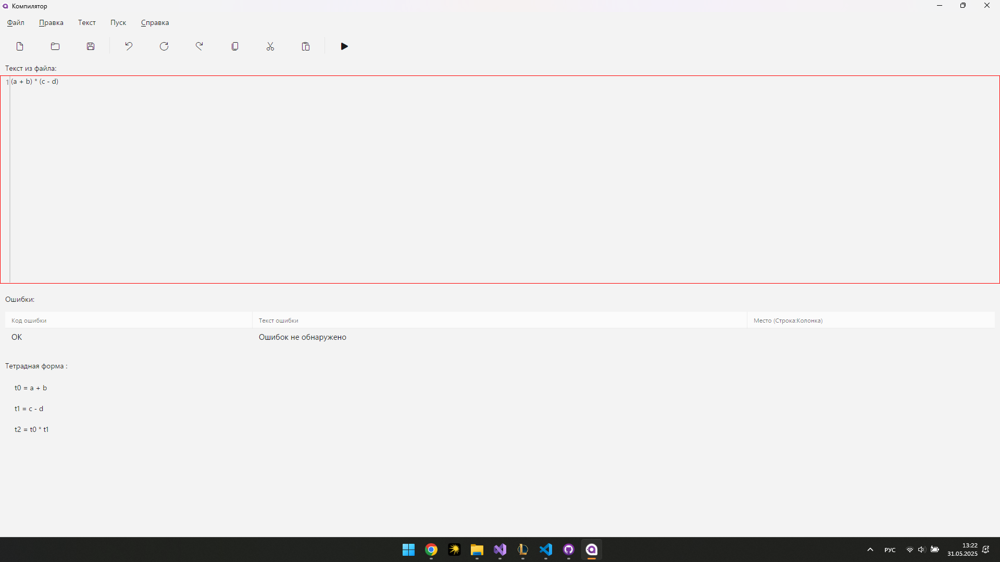

# Анализатор деклараций

Разработка настольного приложения с функциями лексического и синтаксического анализатора деклараций переменных.

## Оглавление

- [Лабораторная работа №1: Создание графического интерфейса](#лабораторная-работа-1-создание-графического-интерфейса)
- [Лабораторная работа №2: Реализация лексического анализатора](#лабораторная-работа-2-реализация-лексического-анализатора)
- [Лабораторная работа №3: Реализация синтаксического анализатора](#лабораторная-работа-3-реализация-синтаксического-анализатора)
- [Лабораторная работа №4: Вывод ошибок и интерфейс взаимодействия](#лабораторная-работа-4-вывод-ошибок-и-интерфейс-взаимодействия)

---

## Лабораторная работа №1: Создание графического интерфейса

**Цель:** разработать GUI для ввода и анализа деклараций переменных.

**Технологии:** Avalonia UI, MVVM, AvaloniaEdit, FluentAvalonia

**Основной интерфейс включает:**

- текстовый редактор с подсветкой синтаксиса
- кнопку запуска анализа
- отображение ошибок в виде таблицы
- возможность открытия, создания и сохранения файлов
- базовую справочную систему
- справочная система (всплывающее окно)
- подтверждение при закрытии с несохранёнными изменениями


**Пример интерфейса:**
Интерфейс приложения


**Пример окна справки:**

**Пример окна подтверждения выхода:**
---

## Лабораторная работа №2: Реализация лексического анализатора

**Цель:** реализовать разбор строки на токены.

**Примеры обрабатываемых токенов:**

- `const`, `f32`, `f64`
- идентификаторы (например, `myVar`)
- числовые значения (например, `123.45`)
- знаки `:`, `=`, `;`

**Пример строки:**

```c
const myVar: f32 = 12.5;
```

**Выделенные токены:**


```
CONST("const"), IDENTIFIER("myVar"), COLON(:), TYPE("f32"), EQUAL(=), NUMBER(12.5), SEMICOLON(;)
```

**Обработка ошибок:** лексер может распознать недопустимые символы, отсутствие пробелов, слитые ключевые слова и т.д.

**Пример диаграммы состояний:**


---

## Лабораторная работа №3: Реализация синтаксического анализатора

**Цель:** реализовать анализ структуры объявления и обнаружение синтаксических ошибок.

**Формат ожидаемой строки:**

```c
const <идентификатор> : <тип> = <число>;
```

**Пример корректной строки:**

```c
const a: f64 = 123.0;
```

**Пример ошибок:**

```c
consta: f32 = abc;
```

- E010 — отсутствие пробела после "const"
- E009 — некорректный числовой литерал


---

## Лабораторная работа №4: Вывод ошибок и интерфейс взаимодействия

**Цель:** связать лексический и синтаксический анализ с визуальным интерфейсом и выводом ошибок.

**Ключевые функции:**

- визуализация ошибок с указанием строки и позиции

---

## Примеры тестов

**Корректный ввод:**

```c
const x: f64 = 123.0;
```

*Вывод:* "Ошибок не обнаружено"

**Ошибки в объявлении:**

```c
const123a: f32 = x;
```

*Вывод:*

- E010 — Отсутствует разделяющий пробел между ключевым словом 'const' и именем переменной.
- E006 — ожидалось числовое значение

---

## Локальный запуск

1. Установите .NET SDK 6+
2. Клонируйте репозиторий:

```bash
git clone https://github.com/LeonidKripakov/TFLandCOMP.git
```

3. Откройте проект в Rider / VS / VSCode
4. Соберите и запустите проект

---

## Лицензия и авторство

Проект создан в рамках лабораторных работ. Автор: Леонид Крипаков, 2025.
